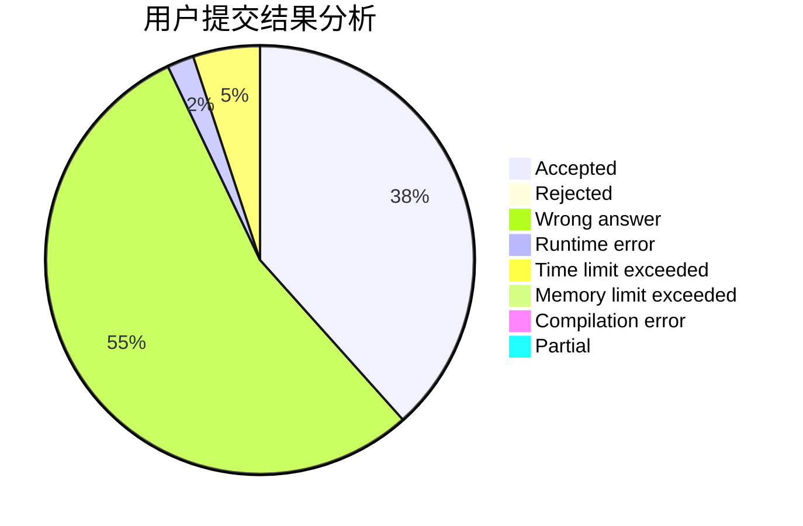
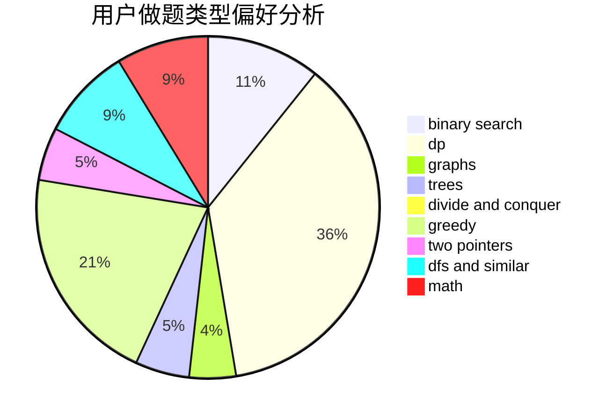

# Quasrain

<!-- tabs:start -->

#### **用户提交结果分析**

#### **用户做题类型偏好分析**

<!-- tabs:end -->
# 推荐题目
[1408C](https://codeforces.com/contest/1408/problem/C)
[1245B](https://codeforces.com/contest/1245/problem/B)
[1474F](https://codeforces.com/contest/1474/problem/F)
[978E](https://codeforces.com/contest/978/problem/E)
[1033G](https://codeforces.com/contest/1033/problem/G)
[1166A](https://codeforces.com/contest/1166/problem/A)
[814C](https://codeforces.com/contest/814/problem/C)
[249E](https://codeforces.com/contest/249/problem/E)
[383E](https://codeforces.com/contest/383/problem/E)
[246D](https://codeforces.com/contest/246/problem/D)
