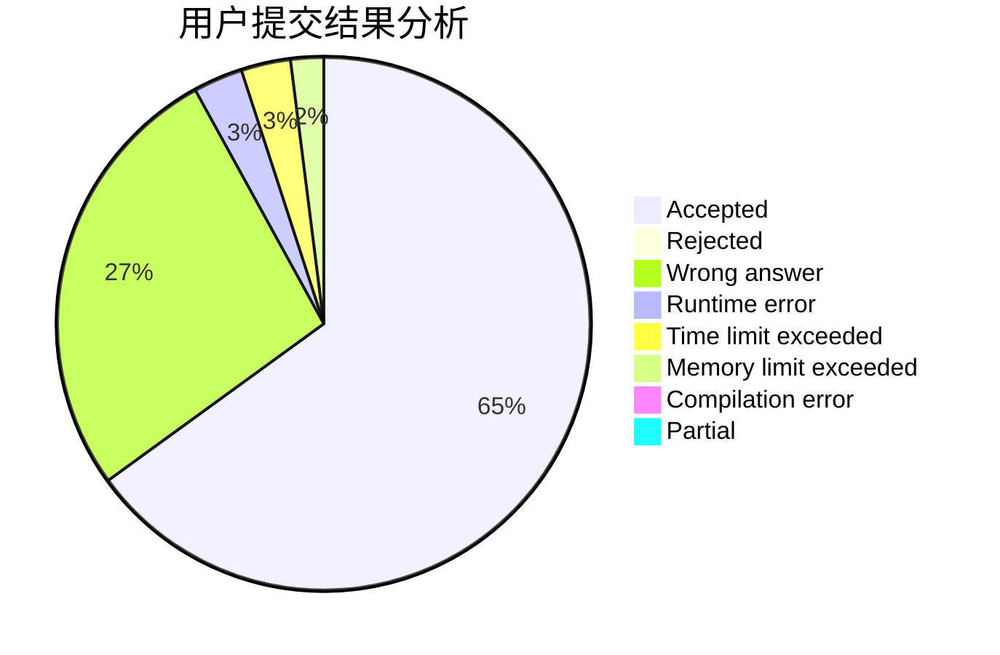
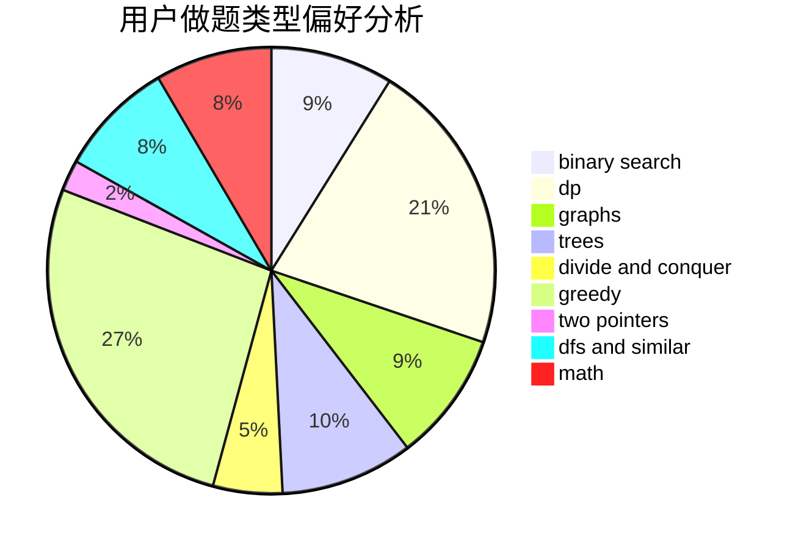

# QwQcOrZ

<!-- tabs:start -->

#### **用户提交结果分析**

#### **用户做题类型偏好分析**

<!-- tabs:end -->
# 推荐题目
[1487B](https://codeforces.com/contest/1487/problem/B)
[1506C](https://codeforces.com/contest/1506/problem/C)
[993B](https://codeforces.com/contest/993/problem/B)
[1504E](https://codeforces.com/contest/1504/problem/E)
[95E](https://codeforces.com/contest/95/problem/E)
[815B](https://codeforces.com/contest/815/problem/B)
[472G](https://codeforces.com/contest/472/problem/G)
[771D](https://codeforces.com/contest/771/problem/D)
[1056C](https://codeforces.com/contest/1056/problem/C)
[1210E](https://codeforces.com/contest/1210/problem/E)
