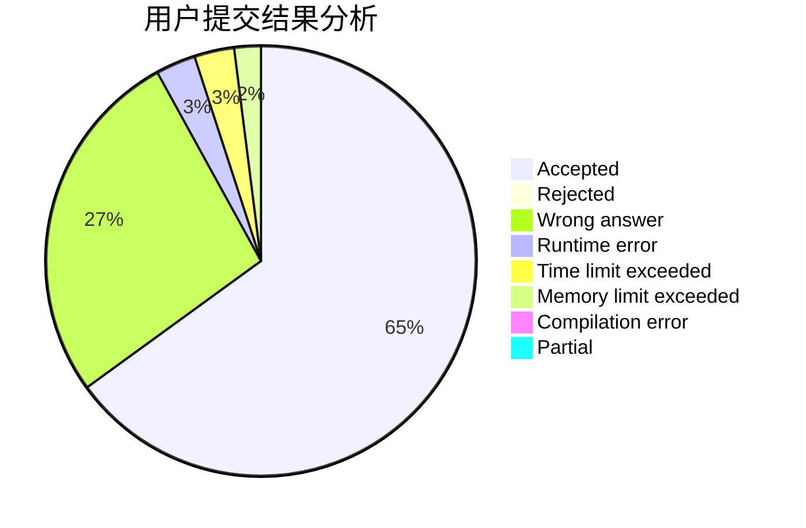
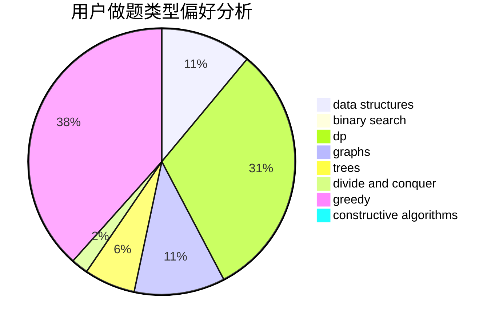
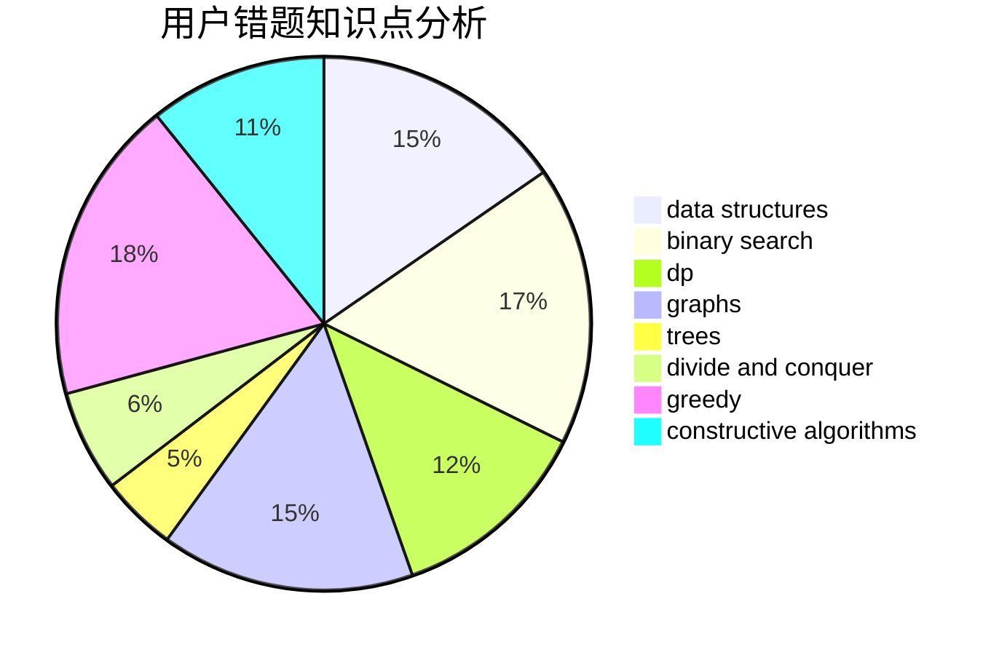

# QwQcOrZ
<!-- tabs:start -->
#### **用户提交结果分析**

#### **用户做题类型偏好分析**

#### **用户错题知识点分析**

<!-- tabs:end -->
# 推荐题目
[Nezzar and Board](https://codeforces.com/contest/1478/problem/D)		constructive algorithms,
                        math,
                        number theory		  
[Treasure Hunt](http://codeforces.com/problemset/problem/979/B)		greedy		  
[Sergey's problem](https://codeforces.com/contest/1020/problem/E)		constructive algorithms,
                        graphs		  
[Tree and XOR](http://codeforces.com/problemset/problem/1055/F)		strings,
                        trees		  
[New Year and Snowy Grid](http://codeforces.com/problemset/problem/750/H)		dfs and similar,
                        dsu,
                        graphs,
                        interactive		  
[Shortest Cycle](https://codeforces.com/contest/1206/problem/D)		bitmasks,
                        brute force,
                        graphs,
                        shortest paths		  
[Nested Segments](http://codeforces.com/problemset/problem/652/D)		data structures,
                        sortings		  
[Voltage Keepsake](https://codeforces.com/contest/800/problem/A)		binary search,
                        math		  
[Vasiliy's Multiset](http://codeforces.com/problemset/problem/706/D)		binary search,
                        bitmasks,
                        data structures,
                        trees		  
[Polycarp and Letters](http://codeforces.com/problemset/problem/864/B)		brute force,
                        implementation,
                        strings		  
<!-- tabs:start -->
#### **data structures**
[Nezzar and Board](http://codeforces.com/problemset/problem/652/D)		data structures,
                        sortings		  
[Treasure Hunt](http://codeforces.com/problemset/problem/706/D)		binary search,
                        bitmasks,
                        data structures,
                        trees		  
[Sergey's problem](https://codeforces.com/contest/90/problem/E)		brute force,
                        data structures,
                        implementation		  
[Tree and XOR](http://codeforces.com/problemset/problem/827/C)		data structures,
                        strings		  
[New Year and Snowy Grid](http://codeforces.com/problemset/problem/486/E)		data structures,
                        dp,
                        greedy,
                        hashing,
                        math		  
[Shortest Cycle](https://codeforces.com/contest/1143/problem/E)		data structures,
                        dfs and similar,
                        dp,
                        math,
                        trees		  
[Nested Segments](http://codeforces.com/problemset/problem/1497/E1)		data structures,
                        dp,
                        greedy,
                        math,
                        number theory,
                        two pointers		  
[Voltage Keepsake](http://codeforces.com/problemset/problem/938/D)		data structures,
                        graphs,
                        shortest paths		  
[Vasiliy's Multiset](http://codeforces.com/problemset/problem/1495/E)		brute force,
                        data structures,
                        greedy,
                        implementation		  
[Polycarp and Letters](http://codeforces.com/problemset/problem/1083/D)		data structures,
                        implementation		  
#### **binary search**
[Nezzar and Board](https://codeforces.com/contest/800/problem/A)		binary search,
                        math		  
[Treasure Hunt](http://codeforces.com/problemset/problem/706/D)		binary search,
                        bitmasks,
                        data structures,
                        trees		  
[Sergey's problem](https://codeforces.com/contest/1011/problem/D)		binary search,
                        interactive		  
[Tree and XOR](http://codeforces.com/problemset/problem/1345/B)		binary search,
                        brute force,
                        dp,
                        math		  
[New Year and Snowy Grid](http://codeforces.com/problemset/problem/938/C)		binary search,
                        brute force,
                        constructive algorithms		  
[Shortest Cycle](http://codeforces.com/problemset/problem/607/A)		binary search,
                        dp		  
[Nested Segments](http://codeforces.com/problemset/problem/1492/C)		binary search,
                        data structures,
                        dp,
                        greedy,
                        two pointers		  
[Voltage Keepsake](http://codeforces.com/problemset/problem/1463/D)		binary search,
                        constructive algorithms,
                        greedy,
                        two pointers		  
[Vasiliy's Multiset](http://codeforces.com/problemset/problem/1490/G)		binary search,
                        data structures,
                        math		  
[Polycarp and Letters](http://codeforces.com/problemset/problem/1479/D)		binary search,
                        bitmasks,
                        brute force,
                        data structures,
                        probabilities,
                        trees		  
#### **dp**
[Nezzar and Board](http://codeforces.com/problemset/problem/486/E)		data structures,
                        dp,
                        greedy,
                        hashing,
                        math		  
[Treasure Hunt](http://codeforces.com/problemset/problem/593/E)		dp,
                        matrices		  
[Sergey's problem](https://codeforces.com/contest/1143/problem/E)		data structures,
                        dfs and similar,
                        dp,
                        math,
                        trees		  
[Tree and XOR](http://codeforces.com/problemset/problem/1497/E1)		data structures,
                        dp,
                        greedy,
                        math,
                        number theory,
                        two pointers		  
[New Year and Snowy Grid](http://codeforces.com/problemset/problem/1345/B)		binary search,
                        brute force,
                        dp,
                        math		  
[Shortest Cycle](http://codeforces.com/problemset/problem/1272/D)		brute force,
                        dp		  
[Nested Segments](http://codeforces.com/problemset/problem/1453/F)		dp		  
[Voltage Keepsake](http://codeforces.com/problemset/problem/607/A)		binary search,
                        dp		  
[Vasiliy's Multiset](http://codeforces.com/problemset/problem/1492/C)		binary search,
                        data structures,
                        dp,
                        greedy,
                        two pointers		  
[Polycarp and Letters](https://codeforces.com/contest/1457/problem/C)		brute force,
                        dp,
                        implementation		  
#### **graph**
[Nezzar and Board](https://codeforces.com/contest/1020/problem/E)		constructive algorithms,
                        graphs		  
[Treasure Hunt](http://codeforces.com/problemset/problem/750/H)		dfs and similar,
                        dsu,
                        graphs,
                        interactive		  
[Sergey's problem](https://codeforces.com/contest/1206/problem/D)		bitmasks,
                        brute force,
                        graphs,
                        shortest paths		  
[Tree and XOR](http://codeforces.com/problemset/problem/908/F)		graphs,
                        greedy,
                        implementation		  
[New Year and Snowy Grid](http://codeforces.com/problemset/problem/938/D)		data structures,
                        graphs,
                        shortest paths		  
[Shortest Cycle](http://codeforces.com/problemset/problem/767/C)		dfs and similar,
                        graphs,
                        greedy,
                        trees		  
[Nested Segments](http://codeforces.com/problemset/problem/1487/C)		brute force,
                        constructive algorithms,
                        dfs and similar,
                        graphs,
                        greedy,
                        implementation,
                        math		  
[Voltage Keepsake](http://codeforces.com/problemset/problem/1437/C)		dp,
                        flows,
                        graph matchings,
                        greedy,
                        math,
                        sortings		  
[Vasiliy's Multiset](http://codeforces.com/problemset/problem/1470/D)		constructive algorithms,
                        dfs and similar,
                        graph matchings,
                        graphs,
                        greedy		  
[Polycarp and Letters](http://codeforces.com/problemset/problem/1476/C)		dp,
                        graphs,
                        greedy		  
#### **trees**
[Nezzar and Board](http://codeforces.com/problemset/problem/1055/F)		strings,
                        trees		  
[Treasure Hunt](http://codeforces.com/problemset/problem/706/D)		binary search,
                        bitmasks,
                        data structures,
                        trees		  
[Sergey's problem](http://codeforces.com/problemset/problem/979/C)		dfs and similar,
                        trees		  
[Tree and XOR](http://codeforces.com/problemset/problem/1143/C)		dfs and similar,
                        trees		  
[New Year and Snowy Grid](https://codeforces.com/contest/1143/problem/E)		data structures,
                        dfs and similar,
                        dp,
                        math,
                        trees		  
[Shortest Cycle](http://codeforces.com/problemset/problem/573/C)		constructive algorithms,
                        dfs and similar,
                        trees		  
[Nested Segments](http://codeforces.com/problemset/problem/767/C)		dfs and similar,
                        graphs,
                        greedy,
                        trees		  
[Voltage Keepsake](http://codeforces.com/problemset/problem/1479/D)		binary search,
                        bitmasks,
                        brute force,
                        data structures,
                        probabilities,
                        trees		  
[Vasiliy's Multiset](http://codeforces.com/problemset/problem/1511/C)		brute force,
                        data structures,
                        implementation,
                        trees		  
[Polycarp and Letters](http://codeforces.com/problemset/problem/1499/F)		combinatorics,
                        dfs and similar,
                        dp,
                        trees		  
#### **divide and conquer**
[Nezzar and Board](http://codeforces.com/problemset/problem/1461/D)		binary search,
                        brute force,
                        data structures,
                        divide and conquer,
                        implementation,
                        sortings		  
[Treasure Hunt](http://codeforces.com/problemset/problem/1466/G)		combinatorics,
                        divide and conquer,
                        hashing,
                        math,
                        string suffix structures,
                        strings		  
[Sergey's problem](http://codeforces.com/problemset/problem/1490/D)		dfs and similar,
                        divide and conquer,
                        implementation		  
[Tree and XOR](https://codeforces.com/contest/1483/problem/C)		data structures,
                        divide and conquer,
                        dp		  
[New Year and Snowy Grid](http://codeforces.com/problemset/problem/1491/E)		brute force,
                        dfs and similar,
                        divide and conquer,
                        number theory,
                        trees		  
[Shortest Cycle](http://codeforces.com/problemset/problem/1303/G)		data structures,
                        divide and conquer,
                        geometry,
                        trees		  
[Nested Segments](http://codeforces.com/problemset/problem/1494/D)		constructive algorithms,
                        data structures,
                        dfs and similar,
                        divide and conquer,
                        dsu,
                        greedy,
                        sortings,
                        trees		  
[Voltage Keepsake](http://codeforces.com/problemset/problem/1482/E)		data structures,
                        divide and conquer,
                        dp		  
[Vasiliy's Multiset](http://codeforces.com/problemset/problem/566/C)		dfs and similar,
                        divide and conquer,
                        trees		  
[Polycarp and Letters](http://codeforces.com/problemset/problem/1428/F)		binary search,
                        data structures,
                        divide and conquer,
                        dp,
                        two pointers		  
#### **greedy**
[Nezzar and Board](http://codeforces.com/problemset/problem/979/B)		greedy		  
[Treasure Hunt](http://codeforces.com/problemset/problem/486/E)		data structures,
                        dp,
                        greedy,
                        hashing,
                        math		  
[Sergey's problem](http://codeforces.com/problemset/problem/908/F)		graphs,
                        greedy,
                        implementation		  
[Tree and XOR](http://codeforces.com/problemset/problem/496/E)		greedy,
                        sortings		  
[New Year and Snowy Grid](http://codeforces.com/problemset/problem/1497/E1)		data structures,
                        dp,
                        greedy,
                        math,
                        number theory,
                        two pointers		  
[Shortest Cycle](https://codeforces.com/contest/1130/problem/D1)		brute force,
                        greedy		  
[Nested Segments](https://codeforces.com/contest/516/problem/A)		greedy,
                        math,
                        sortings		  
[Voltage Keepsake](http://codeforces.com/problemset/problem/1495/E)		brute force,
                        data structures,
                        greedy,
                        implementation		  
[Vasiliy's Multiset](http://codeforces.com/problemset/problem/1209/G1)		data structures,
                        dsu,
                        greedy,
                        implementation,
                        two pointers		  
[Polycarp and Letters](http://codeforces.com/problemset/problem/1256/D)		greedy		  
#### **constructive algorithms**
[Nezzar and Board](https://codeforces.com/contest/1478/problem/D)		constructive algorithms,
                        math,
                        number theory		  
[Treasure Hunt](https://codeforces.com/contest/1020/problem/E)		constructive algorithms,
                        graphs		  
[Sergey's problem](http://codeforces.com/problemset/problem/1205/F)		constructive algorithms,
                        math		  
[Tree and XOR](http://codeforces.com/problemset/problem/573/C)		constructive algorithms,
                        dfs and similar,
                        trees		  
[New Year and Snowy Grid](http://codeforces.com/problemset/problem/938/C)		binary search,
                        brute force,
                        constructive algorithms		  
[Shortest Cycle](http://codeforces.com/problemset/problem/1405/B)		constructive algorithms,
                        implementation		  
[Nested Segments](http://codeforces.com/problemset/problem/1381/A2)		constructive algorithms,
                        data structures,
                        implementation,
                        strings,
                        two pointers		  
[Voltage Keepsake](http://codeforces.com/problemset/problem/1493/A)		constructive algorithms,
                        greedy		  
[Vasiliy's Multiset](http://codeforces.com/problemset/problem/1463/D)		binary search,
                        constructive algorithms,
                        greedy,
                        two pointers		  
[Polycarp and Letters](https://codeforces.com/contest/1456/problem/B)		bitmasks,
                        brute force,
                        constructive algorithms		  
#### **sortings**
[Nezzar and Board](http://codeforces.com/problemset/problem/652/D)		data structures,
                        sortings		  
[Treasure Hunt](http://codeforces.com/problemset/problem/496/E)		greedy,
                        sortings		  
[Sergey's problem](https://codeforces.com/contest/516/problem/A)		greedy,
                        math,
                        sortings		  
[Tree and XOR](https://codeforces.com/contest/1496/problem/C)		geometry,
                        greedy,
                        math,
                        sortings		  
[New Year and Snowy Grid](http://codeforces.com/problemset/problem/1495/A)		geometry,
                        greedy,
                        math,
                        sortings		  
[Shortest Cycle](http://codeforces.com/problemset/problem/1497/A)		brute force,
                        data structures,
                        greedy,
                        sortings		  
[Nested Segments](http://codeforces.com/problemset/problem/1427/A)		math,
                        sortings		  
[Voltage Keepsake](http://codeforces.com/problemset/problem/1461/D)		binary search,
                        brute force,
                        data structures,
                        divide and conquer,
                        implementation,
                        sortings		  
[Vasiliy's Multiset](http://codeforces.com/problemset/problem/1437/C)		dp,
                        flows,
                        graph matchings,
                        greedy,
                        math,
                        sortings		  
[Polycarp and Letters](http://codeforces.com/problemset/problem/1473/A)		greedy,
                        implementation,
                        math,
                        sortings		  
<!-- tabs:end -->
