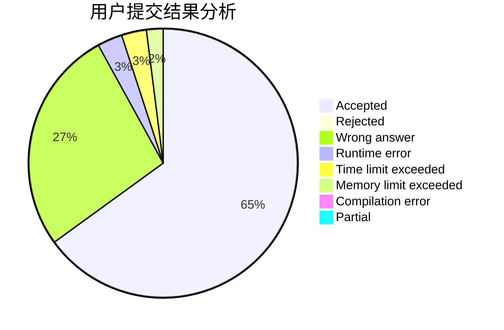
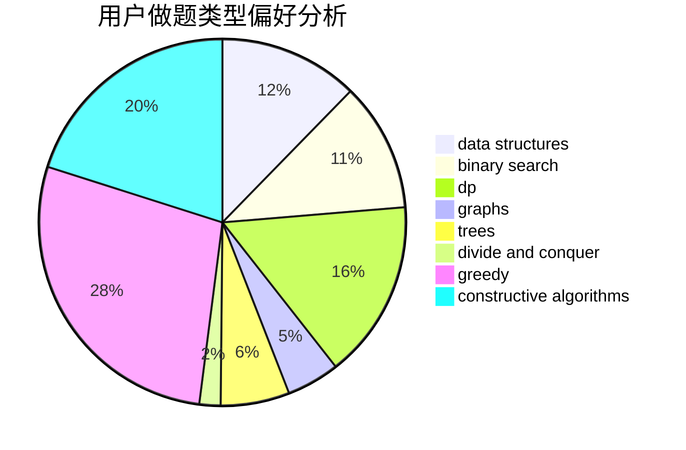
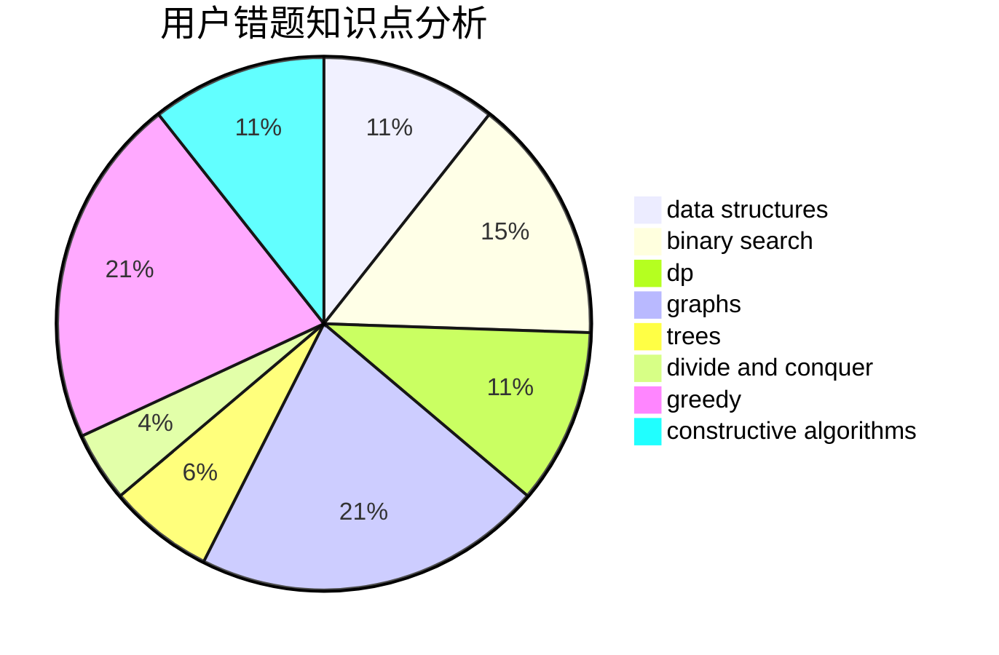

# QwQcOrZ

<!-- tabs:start -->

#### **用户提交结果分析**

#### **用户做题类型偏好分析**

#### **用户错题知识点分析**

<!-- tabs:end -->
# 推荐题目
[1487B](https://codeforces.com/contest/1487/problem/B)		math,
                        number theory		  
[1506C](https://codeforces.com/contest/1506/problem/C)		brute force,
                        implementation,
                        strings		  
[993B](https://codeforces.com/contest/993/problem/B)		bitmasks,
                        brute force		  
[1504E](https://codeforces.com/contest/1504/problem/E)		dsu,graphs,sortings,trees		  
[95E](https://codeforces.com/contest/95/problem/E)		dp,
                        dsu,
                        graphs		  
[815B](https://codeforces.com/contest/815/problem/B)		brute force,
                        combinatorics,
                        constructive algorithms,
                        math		  
[472G](https://codeforces.com/contest/472/problem/G)		bitmasks,
                        data structures,
                        fft		  
[771D](https://codeforces.com/contest/771/problem/D)		dp		  
[1056C](https://codeforces.com/contest/1056/problem/C)		greedy,
                        implementation,
                        interactive,
                        sortings		  
[1210E](https://codeforces.com/contest/1210/problem/E)		math		  
