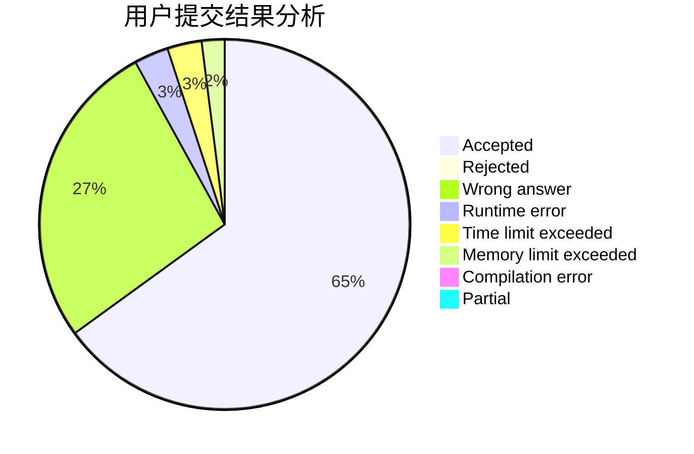
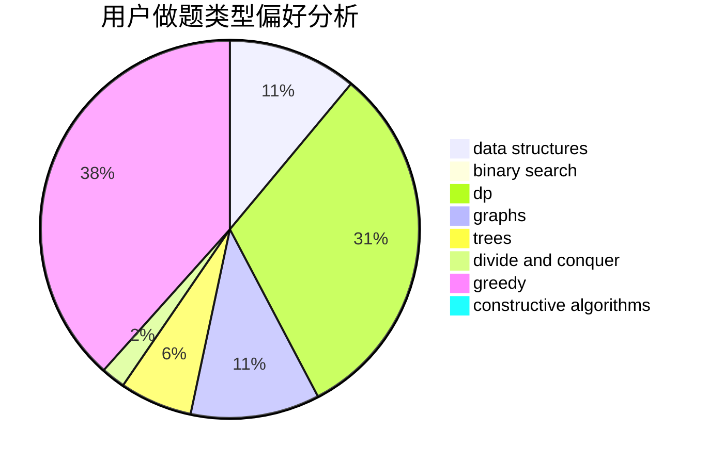
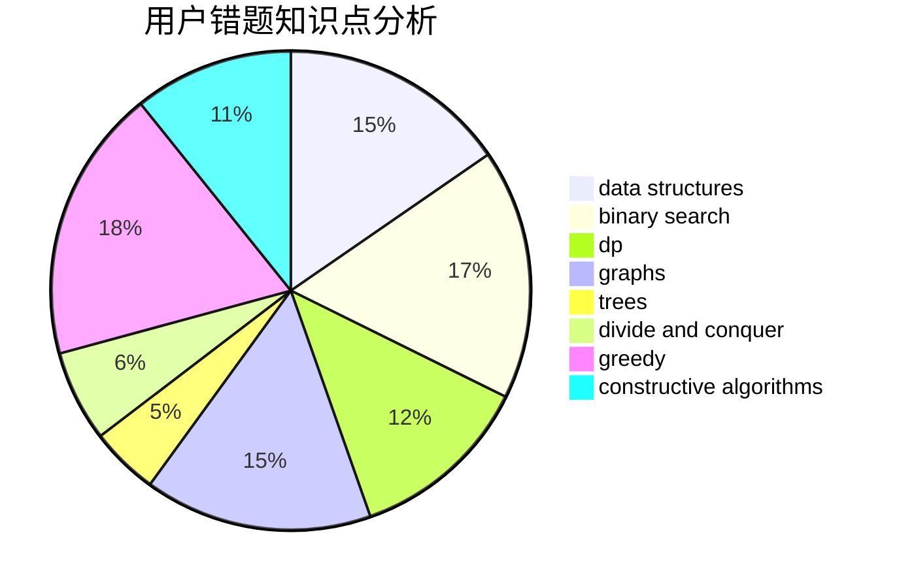

# QwQcOrZ

<!-- tabs:start -->

#### **用户提交结果分析**

#### **用户做题类型偏好分析**

#### **用户错题知识点分析**

<!-- tabs:end -->
# 推荐题目
[1478D](https://codeforces.com/contest/1478/problem/D)		dsu,graphs,sortings,trees		  
[1497E1](https://codeforces.com/contest/1497E/problem/1)		data structures,
                        dp,
                        greedy,
                        math,
                        number theory,
                        two pointers		  
[979B](https://codeforces.com/contest/979/problem/B)		greedy		  
[1495E](https://codeforces.com/contest/1495/problem/E)		brute force,
                        data structures,
                        greedy,
                        implementation		  
[938D](https://codeforces.com/contest/938/problem/D)		data structures,
                        graphs,
                        shortest paths		  
[800A](https://codeforces.com/contest/800/problem/A)		dsu,graphs,sortings,trees		  
[451E](https://codeforces.com/contest/451/problem/E)		bitmasks,
                        combinatorics,
                        number theory		  
[750H](https://codeforces.com/contest/750/problem/H)		dfs and similar,
                        dsu,
                        graphs,
                        interactive		  
[1055F](https://codeforces.com/contest/1055/problem/F)		strings,
                        trees		  
[1206D](https://codeforces.com/contest/1206/problem/D)		dsu,graphs,sortings,trees		  
